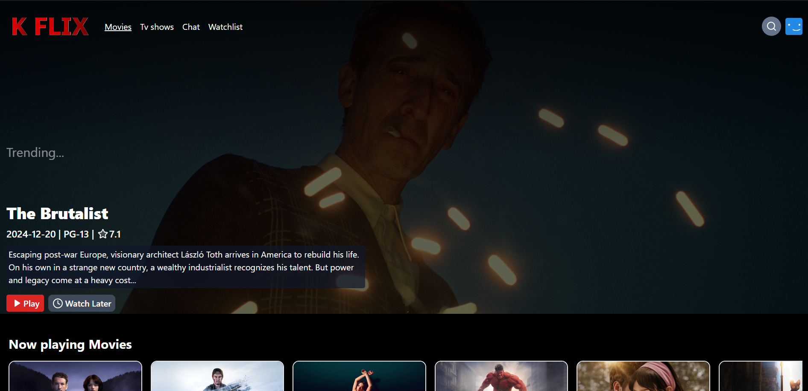
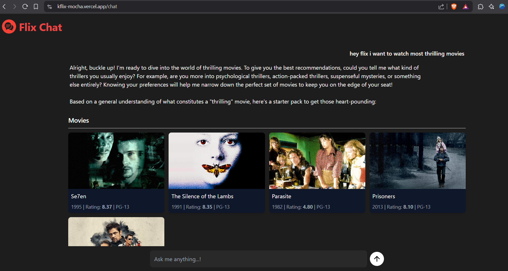
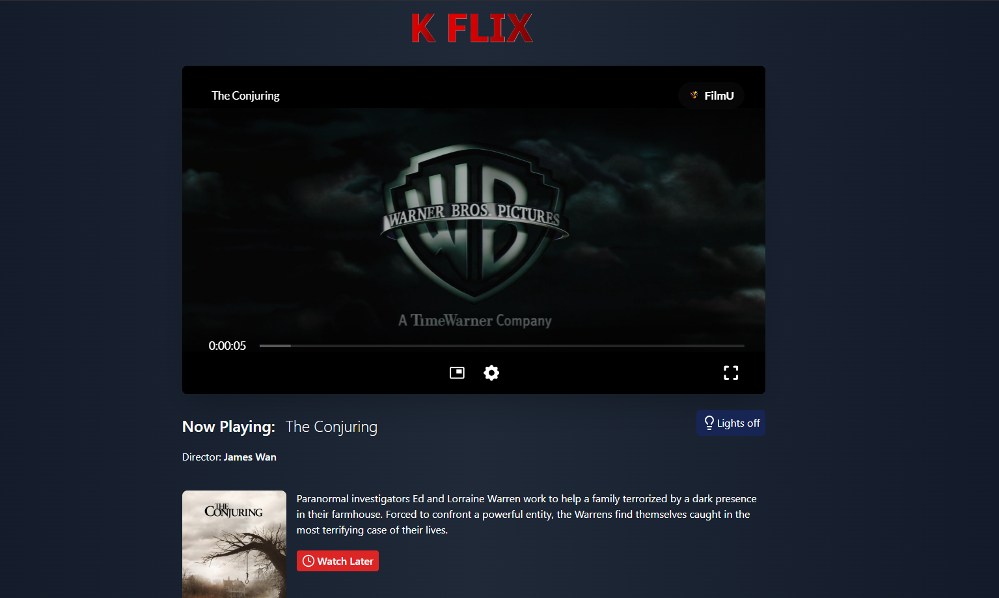

# KFlix - AI-Powered Streaming Platform



A full-stack streaming service clone with AI-powered recommendations, featuring real movie streaming, user profiles, and intelligent search powered by Google's Gemini AI.

## 🌟 Live Demo
Experience KFlix live: [https://kflix-mocha.vercel.app/](https://kflix-mocha.vercel.app/)

## 🚀 Features

- 🎥 **Free Movie/TV Streaming** (Powered by third-party services)
- 🤖 **AI-Powered Search** (Gemini 2.0 Flash integration)
- 🔐 **User Authentication**
- 📺 **Watchlist & History**
- 🔍 **Advanced Search** (Movies/TV/People)
- 🎬 **Similar Content Recommendations**
- 📱 **Responsive Design**

## 📸 Screenshots

| Home Screen | AI Chat | Streaming |
|-------------|---------|-----------|
|  |  |  |

## 🛠 Tech Stack

**Frontend**  


**Backend**  


**Services**  


## 🛠 Installation

### Prerequisites
- Node.js v18+
- MongoDB Atlas account
- TMDB API key
- Google Gemini API key

### Backend Setup
```bash
cd backend
npm install
echo "MONGODB_URI=your_mongodb_uri
TMDB_KEY=your_tmdb_key
GEMINI_KEY=your_gemini_key
JWT_SECRET=your_jwt_secret" > .env
npm start
```

### Frontend Setup
```bash
cd frontend
npm install
# Update Vite config with your IPv4 if needed
npm run dev
```

## 📋 Environment Variables

To run this project, you'll need to configure these environment variables:

### Backend (`.env` file in `/backend`)
```env
# MongoDB Configuration
MONGODB_URI=your_mongodb_atlas_connection_string

# API Keys
TMDB_KEY=your_tmdb_api_v3_key
GEMINI_KEY=your_google_gemini_api_key

# Authentication
JWT_SECRET=your_random_jwt_secret_key
JWT_EXPIRE=24h  # Token expiration time

# Server Configuration
PORT=4000
NODE_ENV=development
```
